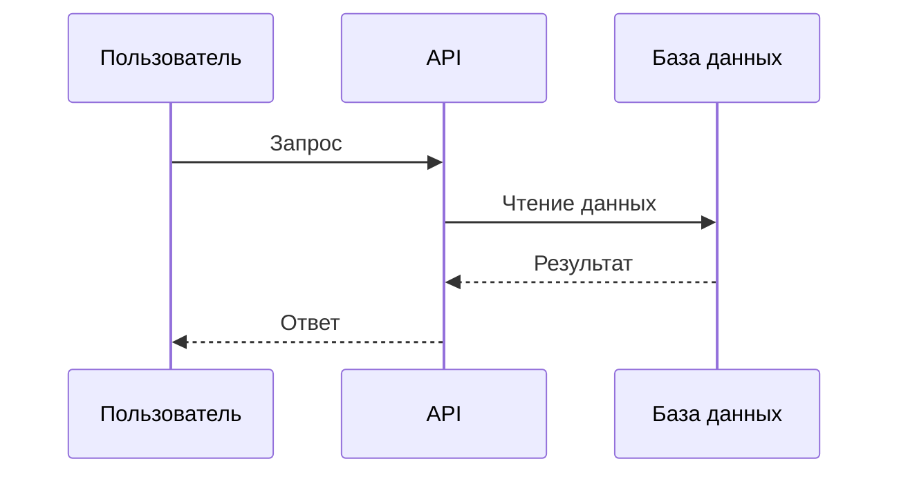

# Solution Architecture: [Название проекта]

## 1. Введение и цели

### Бизнес-цели

<!-- Какую бизнес-задачу решаем, для кого, почему сейчас -->

TODO

### Ключевые стейкхолдеры

| Роль | Интерес |
|------|---------|
| TODO | TODO |

## 2. Ограничения

| Тип | Ограничение |
|-----|-------------|
| Технологические | TODO |
| Организационные | TODO |
| Регуляторные | TODO |

## 3. Контекст и scope (C4 Level 1)

См. [context.mmd](context.mmd)

## 4. Стратегия решения

<!-- Ключевые технологические решения и их обоснование. Ссылки на ADR. -->

TODO

## 5. Building blocks (C4 Level 2-3)

См. [containers.mmd](containers.mmd)

### Описание компонентов

| Компонент | Технология | Ответственность |
|-----------|-----------|-----------------|
| TODO | TODO | TODO |

## 6. Runtime view

### Сценарий: [основной пользовательский сценарий]

## 7. Deployment view

<!-- Как система развёрнута в production -->

TODO

## 8. Crosscutting concerns

### Security

TODO

### Logging & Monitoring

TODO

### Error Handling

TODO

## 9. Architecture decisions

| ADR | Решение | Статус |
|-----|---------|--------|
| [ADR-0001](../decisions/0001-template.md) | TODO | proposed |

## 10. Quality requirements (NFR)

См. [nfr-checklist.md](../quality/nfr-checklist.md)

## 11. Risks and technical debt

| Риск | Вероятность | Влияние | Митигация |
|------|-------------|---------|-----------|
| TODO | TODO | TODO | TODO |
